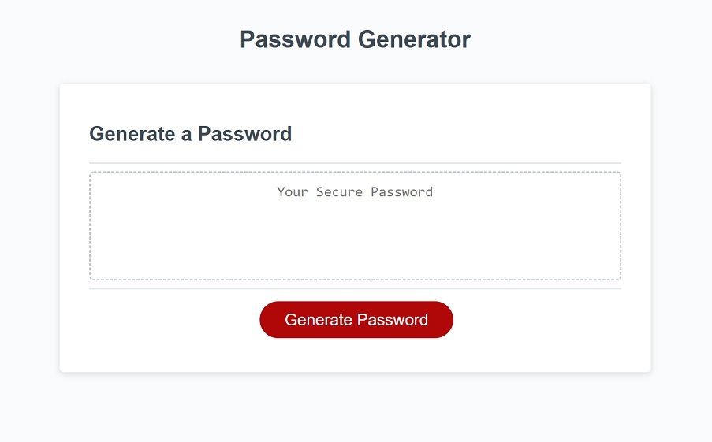
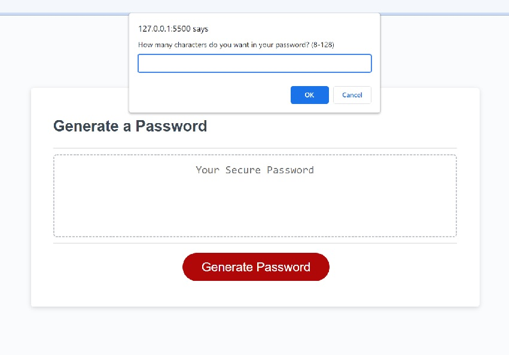
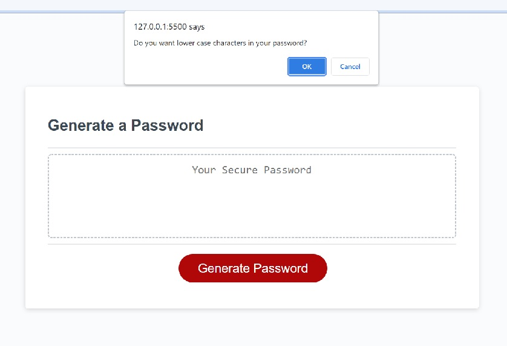
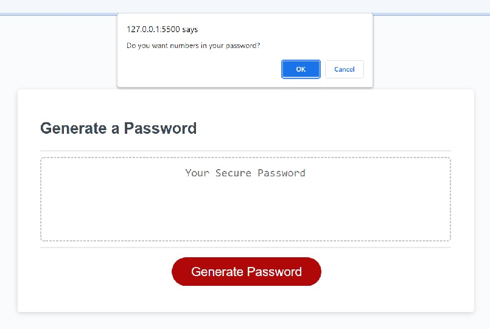
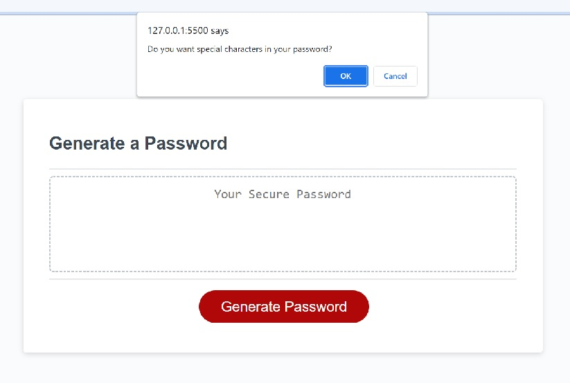
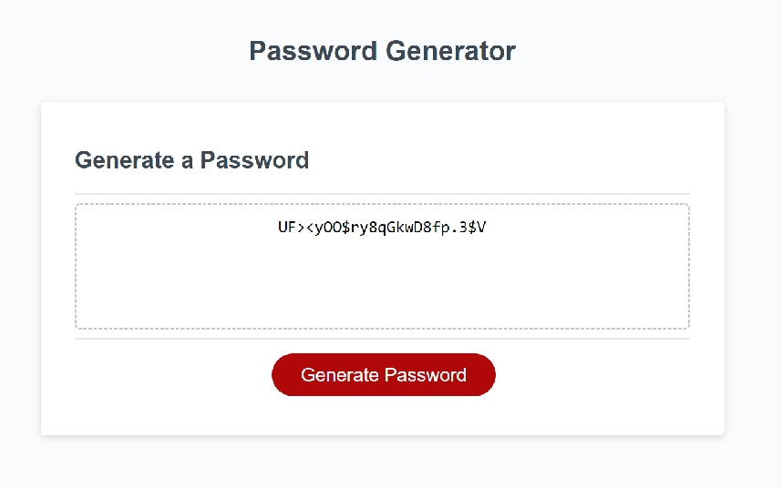
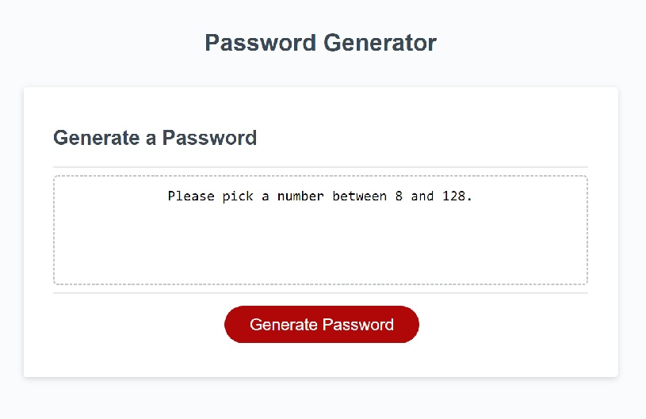

# 03-Homework: Password Generator

## Description

I made a random passowrd generator.

When the "Generate Password" button is clicked, there is a prompt asking how many characters they would like in the user's password.
If the user inputs a number less than 8 or more than 128, the password generator will not ask to confirm what kind of characters the user would like.
Instead, the password generator will return "Please pick a number between 8 and 128."

After the user inputs a number between 8-128, the user will be asked to confirm what kind of characters they would like in their random password(lower case characters, upper case characters, numbers, and special characters).
For each confirmation, the set of characters will be added to a character bank.

A functions is then invoked to take random characters from the character bank and put them into a empty password variable.
The password variable is returned and displayed in the box above the "Generate Password" button.

## Screenshots

]

## Links

GitHub Repository: [https://github.com/jhur628/03-Homework-PasswordGenerator](https://github.com/jhur628/03-Homework-PasswordGenerator)

Deployed Application: [https://jhur628.github.io/03-Homework-PasswordGenerator/](https://jhur628.github.io/03-Homework-PasswordGenerator/)

## Other Comments

Again, I have to give credit to the study group. A lot of my peers had great ideas, and I am very fortunate to be in this boot camp with this class. I will continue to work with my class, and hopefully I can be of some help to them as they have been to me.